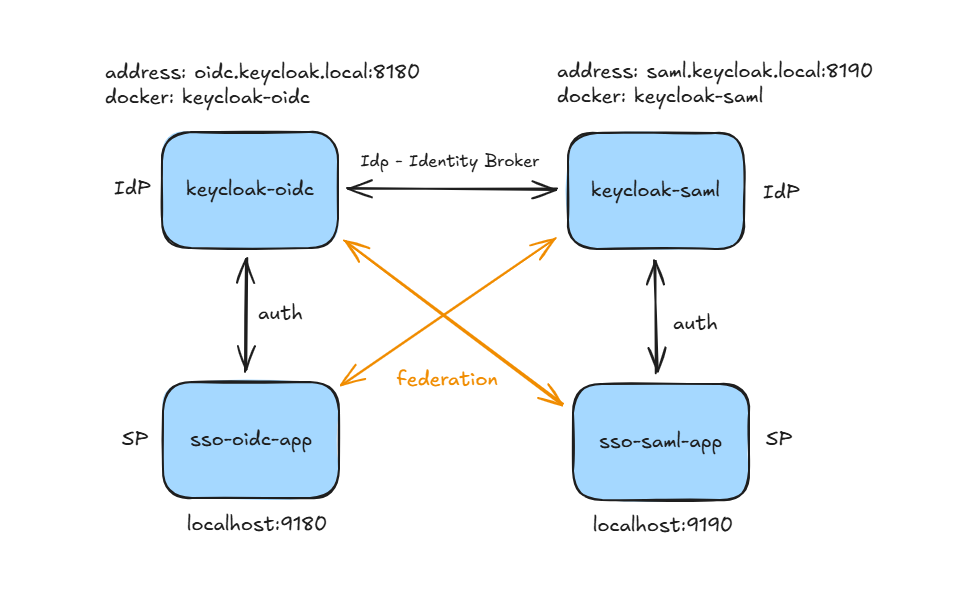

# Terminologia
| Akronim             | Definicja                                                                                         |
|---------------------|---------------------------------------------------------------------------------------------------|
| SSO                 | Single Sign-On – mechanizm pozwalający zalogować się raz i korzystać z wielu aplikacji            |
| Realm               | Izolowany kontekst w Keycloak, w którym definiujemy użytkowników, role, klientów                  |
| Client              | Aplikacja zarejestrowana w Keycloak (OIDC lub SAML)                                               |
| Identity Brokering  | Mechanizm w Keycloak pozwalający mostować protokoły i łączyć IdP                                  |
| IdP                 | Identity Provider – dostawca tożsamości, który uwierzytelnia użytkownika i wystawia token/asercję |
| OIDC                | OpenID Connect – protokół uwierzytelniania oparty na OAuth 2.0, używa tokenów JWT                 |
| Relying party       | Aplikacja inicjująca logowanie                                                                    |
| Resource Server     | /OIDC/aplikacja korzystająca z tożsamości dostarczonej przez IdP                                  |
| JWT                 | JSON Web Token – token w formacie JSON używany w OIDC                                             |
| SP                  | Service Provider – aplikacja korzystająca z tożsamości dostarczonej przez IdP                     |
| SAML                | Security Assertion Markup Language – protokół oparty na XML do federacji tożsamości               |
| Assertion           | Dokument XML w SAML zawierający informacje o użytkowniku                                          |
| Metadata Descriptor | Plik XML opisujący konfigurację IdP/SP (endpointy, certyfikaty)                                   |


# 1. Wprowadzenie
Celem warsztatów jest praktyczne poznanie mechanizmów uwierzytelniania i autoryzacji w Keycloak z wykorzystaniem protokołów **OIDC** i **SAML**, a także konfiguracja mostowania (Identity Brokering) pomiędzy nimi.

Podczas warsztatów:
- Postawimy dwa serwery Keycloak w osobnych kontenerach.
- Skonfigurujemy dwa realmy: jeden dla OIDC, drugi dla SAML.
- Przetestujemy:
  - logowanie i wylogowywanie,
  - autoryzację i role,
  - dodawanie własnych atrybutów użytkownika.
- Omówimy rolę certyfikatów w SAML i OIDC.
- Skonfigurujemy **Identity Broker** i przetestujemy federację pomiędzy OIDC i SAML.

---

# 2. Plan warsztatów
### Przygotowanie środowiska
   - Weryfikacja plików w katalogu `workshop`.
   - Konfiguracja aliasów w `hosts`
   - Generowanie kluczy i certyfikatów (OpenSSL).
   - Uruchomienie kontenerów Keycloak.

`docker compose up -d`


### Omówienie kodu
   - `sso-oidc-app`
   - `sso-saml-app`


### Konfiguracja realmów
   - Konfiguracja scope
   - Konfiguracja redirect URIs i logout URIs.
   - Dodanie atrybutów użytkownika (`salary`, `job`).


### Certyfikaty
    - Omówienie ich roli w SAML (podpisywanie żądań, walidacja).
    - Omówienie deskryptorów / metadanych / discovery.


### Test aplikacji
   - Uruchomienie aplikacji Spring Boot:
     - `sso-oidc-app` (port 9180),
     - `sso-saml-app` (port 9190).


### Identity Brokering
   - Konfiguracja mostowania pomiędzy OIDC i SAML.
   - Test mostowania.


### Dodatkowe przykłady
   - Identity Provider (opcjonalnie Kerberos).

---

# 3. Struktura katalogu `workshop`
```

/workshop
├── docker-compose.yml
├── realms/
│   ├── workshop-saml.json
│   └── workshop-oidc.json
├── certs/
│   ├── saml-cert.pem
│   ├── oidc-cert.pem
│   ├── saml-signing.crt
│   └── saml-signing.key
├── jug-sso-workshop/
│   ├── sso-oidc-app/
└────── sso-saml-app/

```

---

# 4. Środowisko

## Docker
- Obraz: `quay.io/keycloak/keycloak:latest`
- Hosty:
  - `saml.keycloak.local:8180`
  - `oidc.keycloak.local:8190`

## Spring Boot
- `sso-oidc-app`: port **9180**
- `sso-saml-app`: port **9190**

**Alias w `/etc/hosts`:**
```

127.0.0.1 saml.keycloak.local
127.0.0.1 oidc.keycloak.local

````



---

# 5. Certyfikaty
Generowanie klucza i certyfikatu:
```bash
openssl genrsa -out saml-signing.key 4096
openssl req -x509 -key saml-signing.key -out saml-signing.crt -days 777 -subj "/CN=saml-workshop-app"
````

Certyfikat `saml-signing.crt` wgrywamy do konfiguracji klienta SAML w Keycloak (`saml.signing.certificate`).

***

# 6. Testowanie aplikacji

OIDC App
* http://localhost:9180/admin
* http://localhost:9180/user

SAML App
* http://localhost:9190/admin
* http://localhost:9190/user

***

# 7. Mostowanie (Identity Brokering)

Szczegóły dostępne w ramach [Konfiguracja mostowania](identity-brokering.md)

***

# 8. Dokumentacja

Keycloak Server Admin Guide
https://www.keycloak.org/docs/latest/server_admin/index.html


# 9. Problemy z SSO
| Problem | Opis | Rozwiązanie |
|---------|------|------------|
| Niezgodność protokołów | Aplikacja obsługuje tylko OIDC, IdP działa w SAML | Użyj Identity Brokering w Keycloak |
| Błędne Redirect URI | URI niezgodne z konfiguracją klienta | Sprawdź Valid Redirect URIs w Keycloak |
| Brak Single Logout | Wylogowanie działa tylko w aplikacji | Skonfiguruj Post Logout Redirect URIs |
| Problemy z certyfikatami | Brak lub zły certyfikat w SAML | Wgraj poprawny certyfikat do klienta SAML |
| Mapowanie ról | Aplikacja nie widzi ról | Włącz Role Mapper i popraw konfigurację w kodzie |
| Clock Skew | Token odrzucony przez różnicę czasu | Ustaw synchronizację czasu (NTP) |
| Problemy z aliasami | Keycloak nie widzi drugiego serwera | Dodaj aliasy w /etc/hosts |
| Brak HTTPS | Wymagane certyfikaty SSL w produkcji | Włącz HTTPS i wgraj certyfikaty |
| Infinite Redirect Loop | Zapętlenie logowania | Sprawdź redirect_uri i post_logout_redirect_uri |


***

# ✅ Checklist

*   [ ] Sprawdź pliki w katalogu `workshop`.
*   [ ] Dodaj aliasy do `/etc/hosts`.
*   [ ] Wygeneruj certyfikaty i wgraj do konfiguracji.
*   [ ] Uruchom kontenery: `docker compose up -d`.
*   [ ] Dodaj atrybuty użytkownika: `salary`, `job`.
*   [ ] Uruchom aplikacje Spring Boot (`sso-oidc-app`, `sso-saml-app`).
*   [ ] Zweryfikuj role i odblokuj mapowanie w kodzie.
*   [ ] Dodaj Identity Provider (SAML) w OIDC.
*   [ ] Skonfiguruj klienta w SAML dla OIDC.
*   [ ] Dodaj Identity Provider (OIDC) w SAML.
*   [ ] Skonfiguruj klienta w OIDC dla SAML.
*   [ ] Przetestuj logowanie, wylogowanie i federację.


